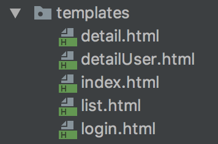

# Software Architecture Document

# Table of Contents
- [Introduction](#1-introduction)
    - [Purpose](#11-purpose)
    - [Scope](#12-scope)
    - [Definitions, Acronyms and Abbreviations](#13-definitions-acronyms-and-abbreviations)
    - [References](#14-references)
    - [Overview](#15-overview)
- [Architectural Representation](#2-architectural-representation)
- [Architectural Goals and Constraints](#3-architectural-goals-and-constraints)
- [Use-Case View](#4-use-case-view)
    - [Use-Case Realizations](#41-use-case-realizations)
- [Logical View](#5-logical-view)
    - [Overview](#51-overview)
    - [Architecturally Significant Design Packages](#52-architecturally-significant-design-packages)
- [Process View](#6-process-view)
- [Deployment View](#7-deployment-view)
- [Implementation View](#8-implementation-view)
    - [Overview](#81-overview)
    - [Layers](#82-layers)
- [Data View](#9-data-view)
- [Size and Performance](#10-size-and-performance)
- [Quality](#11-quality)

## 1. Introduction
### 1.1 Purpose
This document provides a quick architectural overview of the system. It is intended to capture the significant architectural decisions which have been made on the system.

### 1.2 Scope
This document describes the architecture of the Project Puerto Rico Project.

### 1.3 Definitions, Acronyms and Abbreviations
- **MVC:** Model View Controller
- **PPR** Project Puerto Rico
### 1.4 References
n/a
### 1.5 Overview
The architectural details will be described in the following sections.
This includes the class diagrams and the database schema, both give an overview about the whole project, while the different views will focus on the detailed aspects.
## 2. Architectural Representation
Due to the fact that we are developing a web application we decided to use a standard MVC pattern.
We are using controllers to handle our requests, and deliver rendered views.

## 3. Architectural Goals and Constraints
The technology that we are using is Spring Web MVC.
For our Views, we are not using Java Classes, but Thymeleaf templates.
Spring Web MVC and Thymeleaf come with some restraints concerning the programming paradigms and the architecture design.
## 4. Use-Case View
### 4.1 Use-Case Realizations

## 5. Logical View
### 5.1 Overview
### 5.2 Architecturally Significant Design Packages
The views are HTML templates and not classes, and they are not part of this template.
The class diagram containing all Data Access Objects, Models and Controllers that we will need to finish the basic functionality:

Our views are not part of the diagram, but you can see a list right here:

## 6. Process View
n/a
## 7. Deployment View
We are packaging the application as a *war*, and it will be running on an Apache Tomcat.
Everything that is part of the PPR will be deployed.
## 8. Implementation View
### 8.1 Overview
n/a
### 8.2 Layers
n/a
## 9. Data View
The database diagram; containing all tables that we will need to finish the basic functionality:

## 10. Size and Performance
n/a
## 11. Quality
n/a
