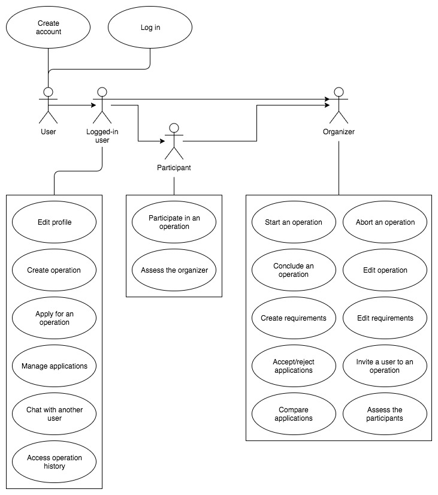

# 1 Introduction

## 1.1 Purpose
This document contains the complete SRS of the Project Puerto Rico.
Project Puerto Rico is going to be designed to make dealing with problems that the government is not talking about easy.
A web interface is designed to allow users from all over the world to create events and specify the resources they need.
These events can contain a description, detailed information that only attendees see, and data such as the location and the date of the event.
Others who wish to participate can apply with their resources and then participate in the event.
Profiles of users inform about the skills and events they have already participated in, to make it easier to find qualified personnel.
Below every technical aspect and feature is described and/or determined.

## 1.2 Scope
This document covers the entire project in every aspect.

## 1.3 Definitions, Acronyms, Abbreviations
- **PPR** - Project Puerto Rico
- **UC** - Use Case
- **UCD** - Use Case Diagram
- **OUCD** - Overall Use Case Diagram
- **SAD** - Software Architecture Document
- **RFC** - Request for Comments

## 1.4 References

|			Title									                            |	Date		|
|-------------------------------------------------------------------------------|---------------|
| [PPR Blog](https://poetzschstroh.wordpress.com/)                              | 21.10.17      |
| [PPR Repository](https://github.com/DrFelder/ppr)                             | 21.10.17      |
| [PPR Documentation Repository](https://github.com/DrFelder/ppr-documentation) | 21.10.17      |
| [PPR Issue Tracker](https://youtrack.surreal.is/)                             | 21.10.17      |

## 1.5 Overview of the SRS
The following chapters are about our vision and perspective, the software requirements, the demands we have, licensing and the technical realisation of this project.

# 2 Overall Description
Everywhere in the world exist problems that governments won't solve.
Many helpers have begun to take on these circumstances to make the world a better place.
Although the helpers are doing the right thing, their actions are mostly illegal.
There is no way to organize such relief activities, and to find qualified personnel and resources.
Our platform is designed to provide a secure way to bring helpers together and organize events.
Users can represent themselves and their skills using a profile, create events, and specify the resources and helper needed.
Others may then apply, and if the project leader considers them to be qualified, participate in the project.
The following diagram shows the UCs:

# 3 Specific Requirements

## 3.1 Functionality

The requirements are organized by user.

### 3.1.1 User
#### 3.1.1.1 Create account
A new account is created by the user, making it possible for him to log in and use the service.
##### Description
The user has to type an email and a password combination and click on create new account. He will be directed to his profile page, where he will be able to edit it. 
##### Pre Condition
The website is shown in the browser
##### Normal Flow of Events
- A form will open, username and password will be entered
- An insert query will be sent to the database
- A notification for success or failure will be shown

#### 3.1.1.2 Edit profile
The user edits his profile, providing information about himself.
##### Description
Editing the profile includes:
- changing profile pictures
- available ressources
- special abilities
- information of himself/herself (public access)
##### Pre Condition
User has an active account and is already logged in.
##### Normal Flow of Events
- The edit form will be shown, desired fields will be changed
- Update query will be sent to the database
- A notification for success or failure will be shown

#### 3.1.1.3 Create Event
An event is created by a user, making him the organizer of the event.
##### Description
Every normal user can create new events, to become an organizer. An eventorganizer must provide several informations about the upcoming event, like
- minimum/maximum/absolute number of participants
- required ressources (must have, optional)
- the public/private(more details) description of the event
- the place/location
##### Pre Condition
User has an active account and is already logged in.
##### Normal Flow of Events
- The create event form will be shown, required data will be filled in 
- Insert query will be sent to the database
- A notification for success or failure will be shown

#### 3.1.1.4 Apply for an event
A user applies for participating in an event as a specified role or providing specified resources.
##### Description
The user can apply for every event he likes. He can fill in the optional comment field.
##### Pre Condition
User has an active account and is already logged in.
##### Normal Flow of Events
- Apply form will be shown, the user confirms it
- A mail will be sent to the organizer

#### 3.1.1.5 Manage applications
An overview over submitted applications and the ability to withdraw them is provided.
##### Description
The User will be given the opertunity to view all his applications. If the event has not taken place yet, the user will be given the oppertunity to withdraw it. 
##### Pre Condition
User has an active account and is already logged in. User has applied and was accepted to at least one event.
##### Normal Flow of Events
- Overview will be shown
- Case withdraw: Eventorganizer will get a notification email
- A notification for success or failure will be shown

#### 3.1.1.6 Chat with another user
The user can chat with another user by inviting him.
##### Description
All Users will have the oppertunity to chat with eachother. Go on the users profile you want to chat with and send him a chat invitation. If he accepts the invitation, a chat will open.
##### Pre Condition
Both users have active accounts and are already logged in.
##### Normal Flow of Events
- Sending email about chat invite to other user
- accept -> open chat
- decline -> notification to sender

#### 3.1.1.7 Access event history
An overview over past events and related information is given.
##### Description
The users will take part in many events, the oraganizer will evaluate the participant. In this overview the user can see his ratings, and the whole history of the events he was part of. he can view them in detail by clicking on them.
##### Pre Condition
User has an active account and is already logged in. User has been accepted to at least one event
##### Normal Flow of Events
- Overview will be shown

### 3.1.2 Organizer
#### 3.1.2.1 Edit event
##### Description
The organizer can edit the event to update provided information like location and time of the event or the description.
##### Pre Condition
- The organizer should be logged in the system
- The organizer should own the event
##### Normal Flow of Events
- The organizer will update event parameters such as description, date etc.
- The organizer will discard/accept the changes
- Changes will be published automatically

#### 3.1.2.2 Create requirements
##### Description
Once the organizer has created an event, he can add specific requirements.
The event can require helpers or equipment (cars etc.).
The requirements can be as specific or generic as the organizer wants them to be.
##### Pre Condition
- The organizer should be logged in the system
- The organizer should own the event
##### Normal Flow of Events
- The organizer will create a new requirement
- The new requirement will be filled with helpful information
- The requirement will be published by the organizer

#### 3.1.2.3 Edit requirements
##### Description
After requirements have been added to an event, the organizer has the possibility to change them, if no applicant has been accepted yet.
He is able to change the requirement in any way he wants; deletion is possible.
##### Pre Condition
- The organizer should be logged in the system
- The organizer should own the event
##### Normal Flow of Events
- The organizer will update requirement parameters
- The organizer will discard/accept the changes
- Made changes will be published automatically

#### 3.1.2.4 Accept/reject applications
##### Description
Once a user has applied to meet a requirement, the organizer can look into the application and the users profile to determine if he is the right guy for the job.
Based on the information provided, the organizer can decide whether he wants to accept or discard an application.
##### Pre Condition
- The organizer should be logged in the system
- The organizer should own the event
##### Normal Flow of Events
- The organizer will be informed about a new application
- The organizer will look at the applicant's profile
- The organizer will accept/reject the application
- If an application is accepted, other applications will be rejected automatically
- The applicants will be informed

#### 3.1.2.5 Compare applications
##### Description
If multiple users decided to apply, the organizer can compare multiple applications to find a fitting participant.
He can accept one of the applications.
##### Pre Condition
- The organizer should be logged in the system
- The organizer should own the event
##### Normal Flow of Events
- The organizer will compare multiple applications
- Important information will be highlighted
- The organizer will be able to accept one of the applications, automatically rejecting all the other applications
- The applicants will be informed

#### 3.1.2.6 Start an event
##### Description
If some of the requirements aren't met, the organizer can still start the event manually.
##### Pre Condition
- The organizer should be logged in the system
- The organizer should own the event
##### Normal Flow of Events
- The organizer will start the event
- All participants are informed
- Applications won't be possible

#### 3.1.2.6 Abort an event
##### Description
If the organizer thinks the event won't be successful, he can abort the event manually.
##### Pre Condition
- The organizer should be logged in the system
- The organizer should own the event
##### Normal Flow of Events
- The organizer will abort the event
- All participants are informed
- The organizer won't be able to change the event in any way

#### 3.1.2.8 Conclude event
##### Description
After an event has been concluded, the organizer can mark it as concluded.
This makes it possible for him to mark the event as successful or failed.
##### Pre Condition
- The organizer should be logged in the system
- The organizer should own the event
##### Normal Flow of Events
- The organizer concludes the event
- The organizer marks the event either as "succeeded" or "failed"
- The organizer won't be able to change the event in any way
- All participants will be informed

#### 3.1.2.9 Assess the participants
##### Description
After an event has been concluded, the organizer can assess the participants.
He can rate them on a scale, and leave a written review.
The reviews will be considered by others in search of helpers and maybe our ranking system.
##### Pre Condition
- The organizer should be logged in the system
- The organizer should own the event
##### Normal Flow of Events
- The organizer will assess the participants, providing a rating and possibly a written review
- The assessed participant will be informed

#### 3.1.2.10 Invite a user to an event
##### Description
If the organizer is in need of a very specific person or if he wants them to be in his team, he can invite them manually.
The invitation has to meet a requirement.
##### Pre Condition
- The organizer should be logged in the system
- The organizer should own the event
- A requirement should exist that could be fulfilled by the invited user
##### Normal Flow of Events
- The organizer will invite a person as a helper meeting a requirement
- The invited user will be informed
- Applications for the requirement will be blocked until the invited user accepts/rejects the invitation
- The organizer will be informed about the outcome of the invitation

### 3.1.3 Participant
#### 3.1.3.1 Join the event (access hidden information, join the team chat)
After an application has been accepted, the user can access the team chat and hidden information of the event provided by the organizer.
##### Description
##### Pre Condition
##### Normal Flow of Events
- event

#### 3.1.3.2 Assess team leaders
After the event is concluded, participants can assess the team leader.
##### Description
##### Pre Condition
##### Normal Flow of Events
- event

## 3.2 Usability

### 3.2.1 30 minute training time
#### Description
It shouldn't take a user longer than 30 minutes to get a complete overview over the functions of our platform.
After 30 minutes, a user should be able to participate in an event, to create an event and requirements and to manage applications and assessments. 
#### Pre Condition
- The user owns a PC that is connected to the internet
- The user knows how to fully operate a PC
- The user has access to the documentation or a person that can explain the tool to him

TODO: Farbenblinde und text groß

## 3.3 Reliability

### 3.3.1 Availability
The tool should have a 95% uptime.
As this tool is a webservice that the whole world can use, users should be able to access it every time they want to.
The users will be warned about maintenance one day in advance. 
#### Pre Condition
- The ISP provides 99% uptime 
- The maintenance is not crucial due to security issues

### 3.3.2 Mean Time To Repair
The mean time the system will be down after it failed should be about 6 hours.

### 3.3.3 Defect Rate
The average defect rate should not exceed 25 defects/KLOC during in-house testing and 5 defects/KLOC in the released product.

## 3.4 Performance
The system should be fast enough to provide a good user experience.
The UX should be comparable to common sites like [meetup.com](https://www.meetup.com).
### 3.4.1 Response time
The average response time for a transaction should be 250ms.
The maximum response time for a transaction should be 1s.

### 3.4.2 Transactions per second
The transactions per seconds should not exceed 200 per second if the server that is available to us is going to be used to run the site.

## 3.4.3 Resource utilization
Resource utilization should be kept as low as possible.
Some bottlenecks might be Spring MVC and OpenJDK.

## 3.5 Supportability
### 3.5.1 Coding standards
We are going to use checkstyle and Google's coding convention to keep our Java code similar.
If a team member has good reasons to validate the checkstyle rules, the code will still be accepted by the reviewer.

### 3.5.2 Naming conventions
For HTML naming conventions, we are going to stick with [BEM](http://getbem.com/) to create clean, reusable views.

## 3.6 Design Constraints
### 3.6.1 Spring MVC
Some constraints are caused by the Spring MVC, these affect the structure of our MVC and our code.

### 3.6.2 Java
Our software is going to be written in Java, which results in some constraints affecting the way our code interacts with the hardware.
The software will run on a JVM.

### 3.6.3 HTML5, CSS3, JavaScript
The use of these technologies/languages to display the frontend constrains the design in many ways.
Due to the fact that PPR is a web application there is no way around HTML5, CSS3 and JavaScript.

## 3.7
### 3.7.1 Documentation scope
The documentation should be extensive enough to fully explain the use of our tool to anyone.

### 3.7.2 Documentation availability
The documentation should be available online.

### 3.8 Purchased Components
(n/a)

## 3.9 Interfaces

### 3.9.1 User Interfaces
#### 3.9.1.1 Web Interface
The software should provide a sophisticated user interface that can be accessed over the internet using a browser.
The user will encounter different views whilst using the website.

### 3.9.2 Hardware Interfaces
(n/a)

### 3.9.3 Software Interfaces
(n/a)

### 3.9.4 Communications Interfaces
(n/a)

## 3.10 Licensing Requirements
### 3.10.1 GNU General Public License
Everything that is part of the PPR is licensed under the GNU General Public License v3, including the documentation and the [blog](poetzschstroh.wordpress.com) contents. 

## 3.11 Legal, Copyright, and Other Notices
(n/a)

## 3.12 Applicable Standards
Applied standards:
- [HTTP 1.1](https://www.w3.org/Protocols/rfc2616/rfc2616.html)
- [ECMAScript® 2017](https://www.ecma-international.org/ecma-262/8.0/)
- [RFC 2396](https://www.ietf.org/rfc/rfc2396.txt)

Used recommendations:
- [HTML5](https://www.w3.org/TR/html5/)

# 4 Supporting Information
To get the latest news about the project, please visit our [blog](poetzschstroh.wordpress.com) or have a look at the [links](#1.4-references) above 