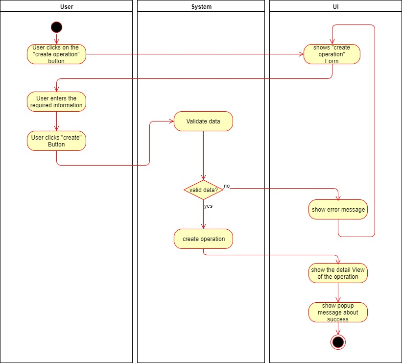
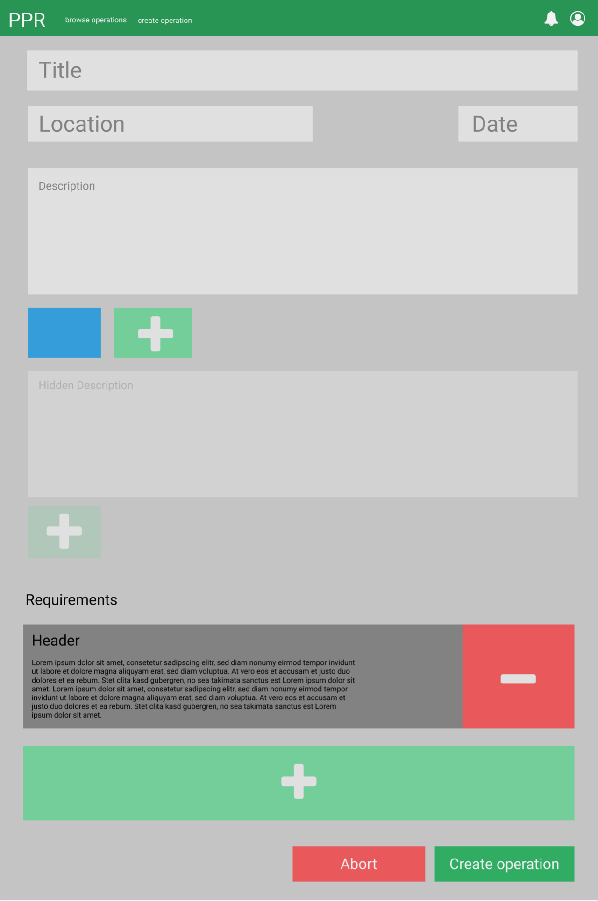

# 1 Use-Case Name
Create operation

## 1.1 Brief Description
Every normal user can create new operations, making him the organizer of the newly created operation. An organizer must provide a good deal of information about the upcoming operation, like

- required ressources (must have, optional)
- the public and the public description of the operation
- the place/location
- the date and time the operation takes place 

The information can be split into a public and a private part. The private part can only be seen by accepted team members.

# 2 Flow of Events
## 2.1 Basic Flow
- User clicks on "create operation" button
- User fills in the the form
- User clicks on "create" to create the operation, he will be sent to the details view of the operation. A success message will be shown.
- User clicks on "cancel" to close the form without saving the operation.

### 2.1.1 Activity Diagram

### 2.1.2 Wireframe

## 2.2 Alternative Flows
(n/a)

# 3 Special Requirements
(n/a)

# 4 Preconditions
## 4.1 Login
The user has to be logged in to the system.

# 5 Postconditions
(n/a)
 
# 6 Extension Points
(n/a)

 
