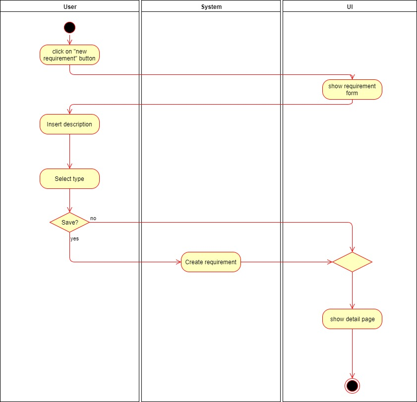

# 1 Use-Case Name
Create Requirement

## 1.1 Brief Description
Any operations has some kind of requirements, e.g. a car for the way there or an ax to chop some wood can be needed. The organiser can create
those requirements and the users can apply for them.

# 2 Flow of Events
## 2.1 Basic Flow
- User clicks on "new requirement"
- User fills in the needed data
- User clicks on "save", he will be sent to the detail page
- User clicks on "cancel", he will be sent to the detail page

### 2.1.1 Activity Diagram

### 2.1.2 Mock-up

### 2.1.3 Narrative
(n/a)

## 2.2 Alternative Flows
(n/a)

# 3 Special Requirements
(n/a)

# 4 Preconditions
## 4.1 Login
The user has to be logged in to the system.
## 4.2 Own Operation
The user has to be an organizer of the operation.
# 5 Postconditions
(n/a)
 
# 6 Extension Points
(n/a)
