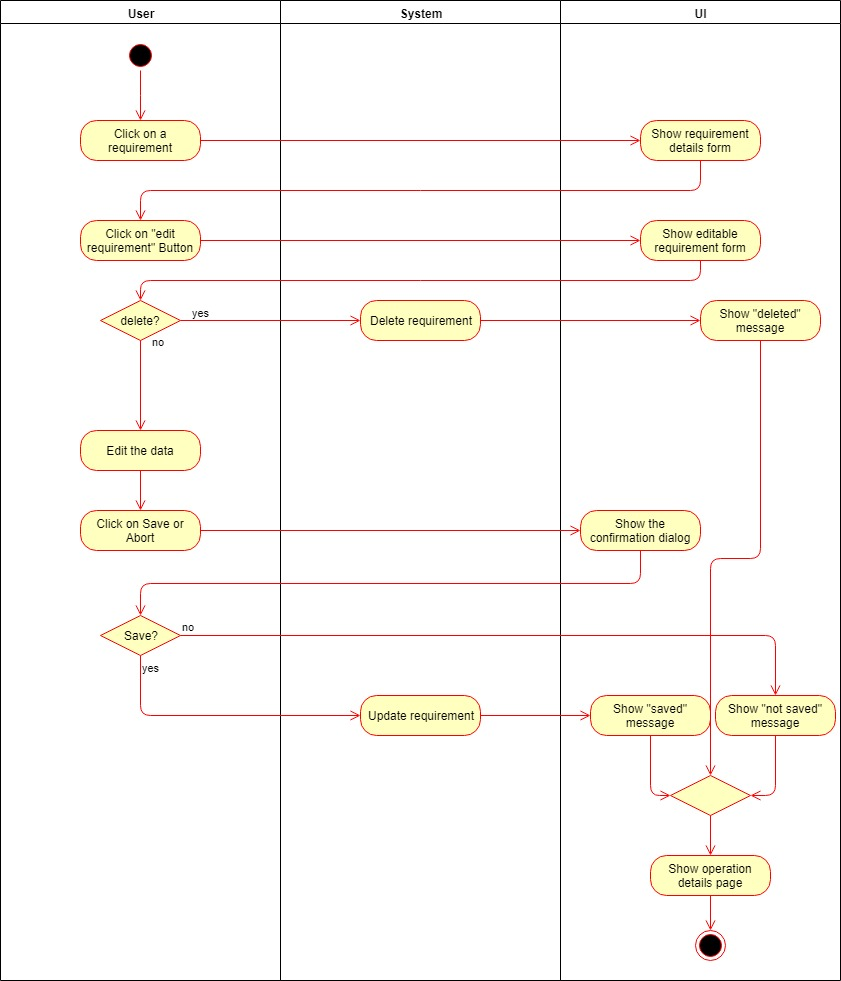
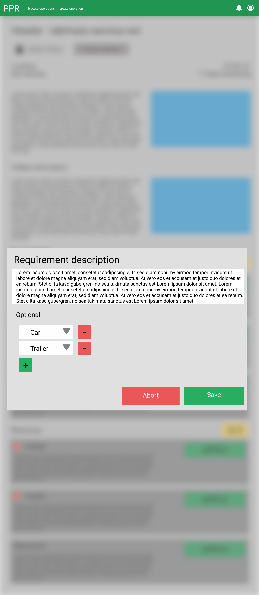

# 1 Use-Case Name
Edit Requirements

## 1.1 Brief Description
The organizer of an operation can add requirements to an operation. Some of the requirements may change or become obsolete over time. The Organzier can choose those requirements and edit them.

# 2 Flow of Events
## 2.1 Basic Flow
- Organizer opens the operation 
- Organizer clicks on a requirement
- Organizer clicks on "edit requirement" 
- Organizer edits the requirement data
- Organizer clicks on "save", he will be sent to the operation details page
- Organizer clicks on "cancel", he will be sent to the operation details page

### 2.1.1 Activity Diagram

### 2.1.2 Mock-up

### 2.1.3 Narrative
(n/a)

## 2.2 Alternative Flows
(n/a)

# 3 Special Requirements
(n/a)

# 4 Preconditions
## 4.1 Login
The user has to be logged in to the system.
## 4.2 Own Operation
The user has to be an organizer of the operation.
# 5 Postconditions
(n/a)
 
# 6 Extension Points
(n/a)
