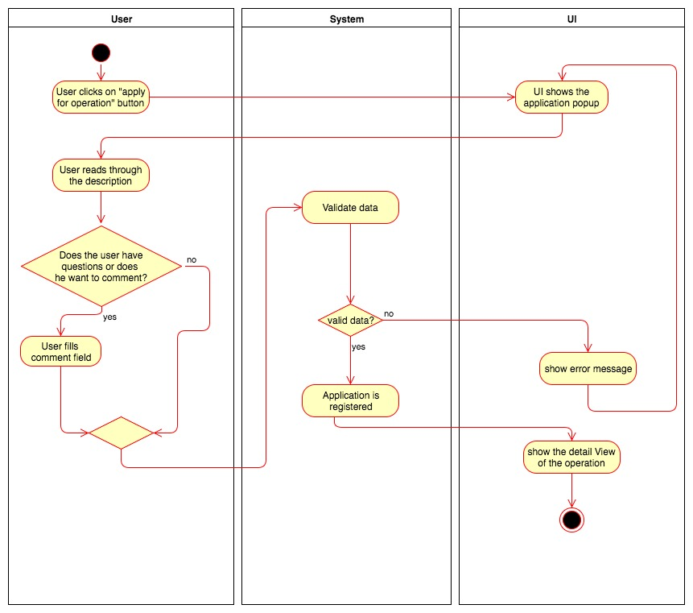

# 1 Use-Case Name
Apply for an operation

## 1.1 Brief Description
A user applies for participating in an operation as a specified role or providing specified resources.
The user can apply for every operation he likes, he can fill in the optional question field if he wants to.

# 2 Flow of Events
## 2.1 Basic Flow
- The user clicks the application button.
- The user is presented with a popup containing the header and description of the requirement, a comment field and buttons for sending and aborting the application.
- If the user wants to, he can enter a comment or a question into the comment field.
- If the user clicks the abort button, he is sent back to where he left of, and nothing more happens.
- If the user sends the application, he is sent back to where he left of.
- The organizer of the operation is notified.
- The fields that displayed the requested amount of resources now displays the status of the application.

### 2.1.1 Activity Diagram

### 2.1.2 Mockups

## 2.2 Alternative Flows
(n/a)

# 3 Special Requirements
(n/a)

# 4 Preconditions
## 4.1 Login
The user has to be logged in to the system.
## 4.2 Operation Existence
An operation with requirements that can be met by the user has to exist

# 5 Postconditions
(n/a)
 
# 6 Extension Points
(n/a)

 