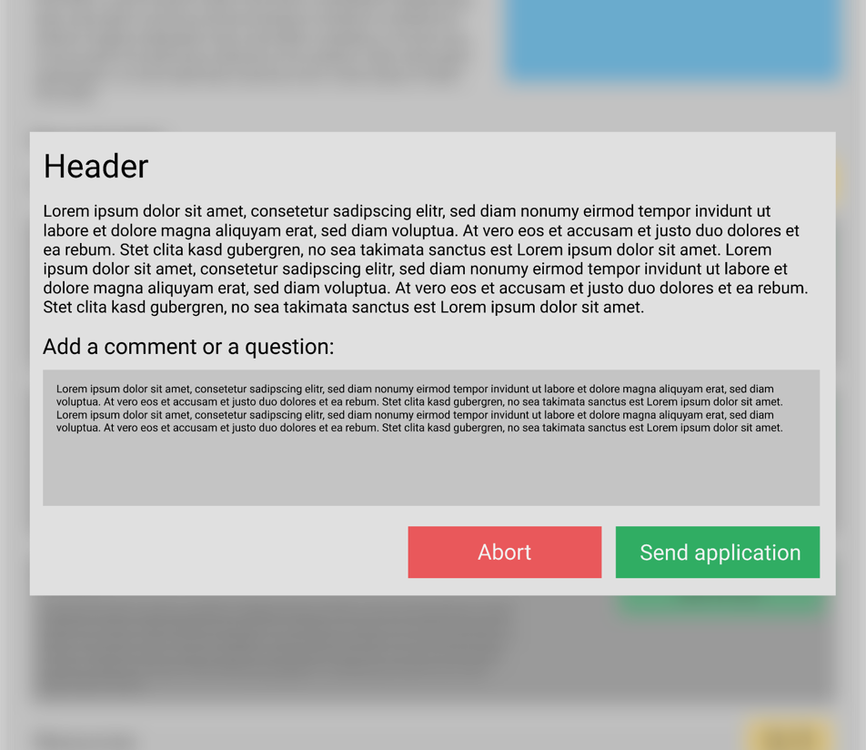

# 1 Use-Case Name
Apply for an operation

## 1.1 Brief Description
A user applies for participating in an operation as a specified role or providing specified resources.
The user can apply for every operation he likes, he can fill in the optional question field if he wants to.

# 2 Flow of Events
## 2.1 Basic Flow
- The user clicks the application button.
- The user is presented with a popup containing the header and description of the requirement, a comment field and buttons for sending and aborting the application.
- If the user wants to, he can enter a comment or a question into the comment field.
- If the user clicks the abort button, he is sent back to where he left of, and nothing more happens.
- If the user sends the application, he is sent back to where he left of.
- The organizer of the operation is notified.
- The fields that displayed the requested amount of resources now displays the status of the application.

### 2.1.1 Activity Diagram


### 2.1.2 Mock-up


### 2.1.3 Narrative
```gherkin
Feature: Applying for an operation
  As a logged in user
  I want to be able to apply for an operation to fulfil a requirement

  Background:
    Given The testing database is used
    And I am on the homepage

  Scenario: Apply for helper role
    Given I am signed in with username "user" and password "password"
    And I am on the operation detail page for operation "Delivering paper towels"
    Then I should see "Requirements"
    And I should see the "Driver" requirement
    When I click on "apply" at the "Driver" requirement
    And I enter "Is this a test question?" in the "Add a comment or question:" field
    And I click on "Send application"
    Then I should be on the operation detail page for operation "Delivering paper towels"
    And I should see "applied"

  Scenario: Abort application for helper role
    Given I am signed in with username "user" and password "password"
    And I am on the operation detail page for operation "Delivering paper towels"
    Then I should see "Requirements"
    And I should see the "Driver" requirement
    When I click on "apply" at the "Driver" requirement
    And I click on "Abort application"
    Then I should be on the operation detail page for operation "Delivering paper towels"
    And I should not see "applied"
```

## 2.2 Alternative Flows
(n/a)

# 3 Special Requirements
(n/a)

# 4 Preconditions
## 4.1 Login
The user has to be logged in to the system.
## 4.2 Operation Existence
An operation with requirements that can be met by the user has to exist

# 5 Postconditions
(n/a)
 
# 6 Extension Points
(n/a)

