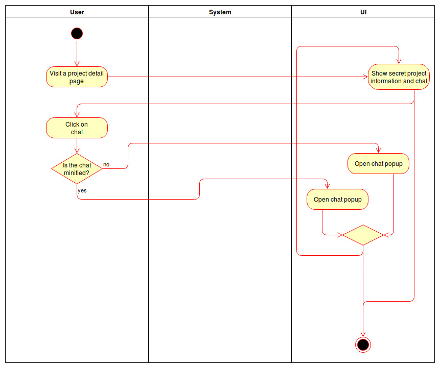

# 1 Use-Case Name
Participate in an operation

## 1.1 Brief Description
The operation owner can choose users from the given applications. The user can accept the participation, afterwards it is considered binding.

# 2 Flow of Events
## 2.1 Basic Flow
- User clicks in "participate" Button
- User accepts the participation, he will be sent to the operation details page
- User declines the participation, he will be sent to the operations details page

### 2.1.1 Activity Diagram

### 2.1.2 Mock-up

### 2.1.3 Narrative
(n/a)

## 2.2 Alternative Flows
(n/a)

# 3 Special Requirements
(n/a)

# 4 Preconditions
## 4.1 Login
The user has to be logged in to the system.
## 4.2 Own Operation
The user has to be an organizer of the operation.
# 5 Postconditions
(n/a)
 
# 6 Extension Points
(n/a)
