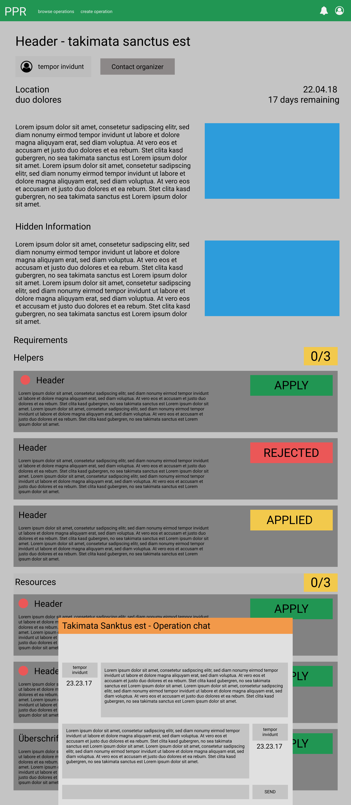

# 1 Use-Case Name
Participate in an operation

## 1.1 Brief Description
Once the user is participating in an operation, he can access the team chat and hidden information about the operation provided by the organizer.

# 2 Flow of Events
## 2.1 Basic Flow
- User accesses the project detail page
- User can see the hidden operation information and the minified operation chat popup
- User can minimize and maximize the chat popup

### 2.1.1 Activity Diagram

### 2.1.2 Mock-up

### 2.1.3 Narrative
(n/a)

## 2.2 Alternative Flows
(n/a)

# 3 Special Requirements
(n/a)

# 4 Preconditions
## 4.1 Login
The user has an active account and is already logged in.
## 4.2 Be an accepted member of the Operation
The user was accepted by an organizer.

# 5 Postconditions
(n/a)
 
# 6 Extension Points
(n/a)
