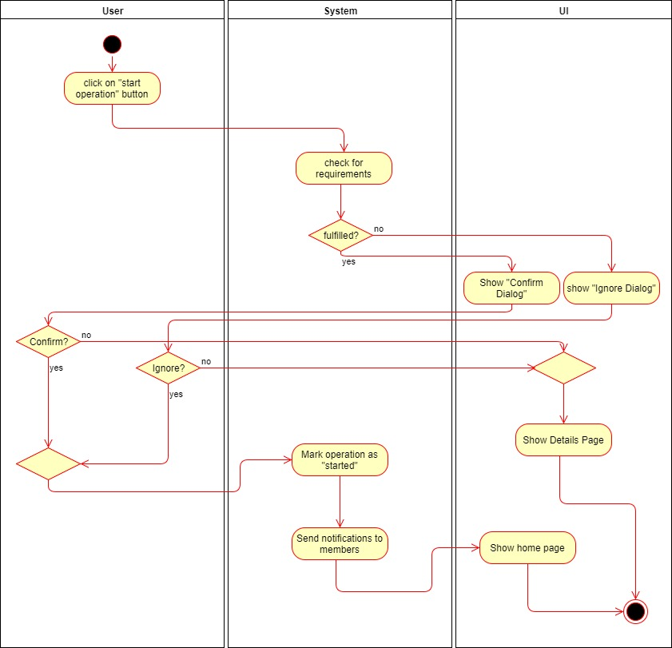
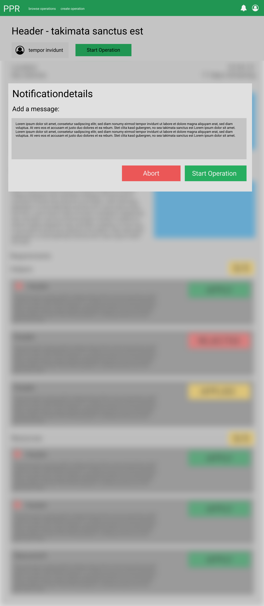
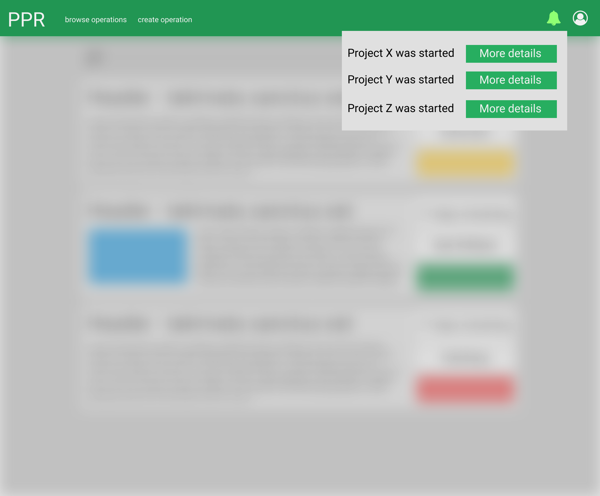

# 1 Use-Case Name
Start Operation

## 1.1 Brief Description
The organizer of an operation has the opportunity to start his operation. All the operationmembers will receive a short summary as a notification, about the upcoming operation.

# 2 Flow of Events
## 2.1 Basic Flow
- User clicks on "start operation" button
- If some requirements are not fulfilled, the user can either ignore them or get back to the operation detail page
- User clicks on "ignore, start anyways", he will be sent to the main page
- User clicks on "start", he will be sent to the main page
- User clicks on "cancel", he will be sent to the detail page 

### 2.1.1 Activity Diagram

### 2.1.2 Mock-up

### 2.1.3 Narrative
(n/a)

## 2.2 Alternative Flows
(n/a)

# 3 Special Requirements
(n/a)

# 4 Preconditions
## 4.1 Login
The user has to be logged in to the system.
## 4.2 Own Operation
The user has to be an organizer of the operation.
# 5 Postconditions
(n/a)
 
# 6 Extension Points
(n/a)
